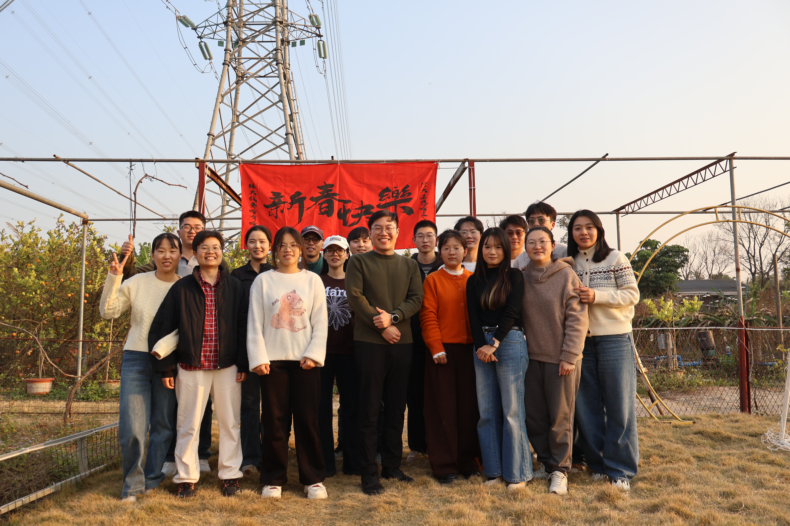
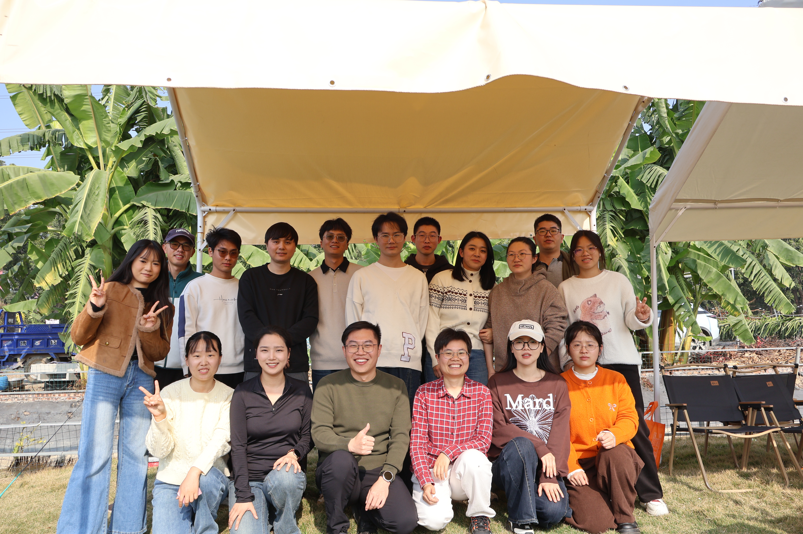
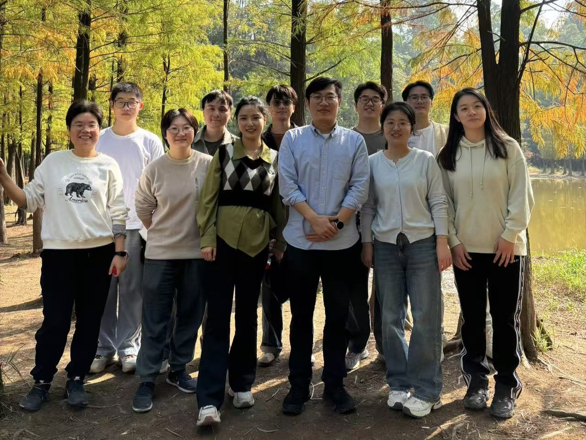
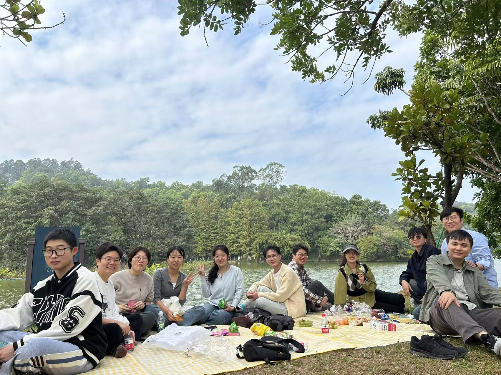

# News

**Feb 2026** 

- 团建

<table>
    <tr>
         <td>

</td>
        <td>

</td>
   </tr>
</table>

- 欢迎黄依莎研究实习员、王艳耐硕士生加入课题组

**Jul 2025** 

- 团建
<table>
    <tr>
        <td></td>
   </tr>
</table>

- 欢迎朱文熙研究实习员加入课题组

**Mar 2025** 

- 恭喜孟小高博士一作文章“Spatiotemporal transcriptome atlas of developing mouse lung”在***Science Bulletin***期刊发表，[中国科学院广州健康院公众号报道](https://mp.weixin.qq.com/s/h5nGKEJ0fft2lKSaQzUwVg)  

**Feb 2025**

- 欢迎孟小高博士（博士后）加入课题组

**Dec 2024** 

- 恭喜博士生杨佳鑫一作综述文章“Roles of the NR2F Family in the Development, Disease, and Cancer of the Lung”在***Journal of Developmental Biology***期刊发表，[MDPI公众号报道](https://mp.weixin.qq.com/s/rNAkr2ebmHB_WfpeR9-j0Q)  	
- 大夫山骑行、野餐

<table>
    <tr>
        <td>

</td>
        <td>

</td>
    </tr>
</table>